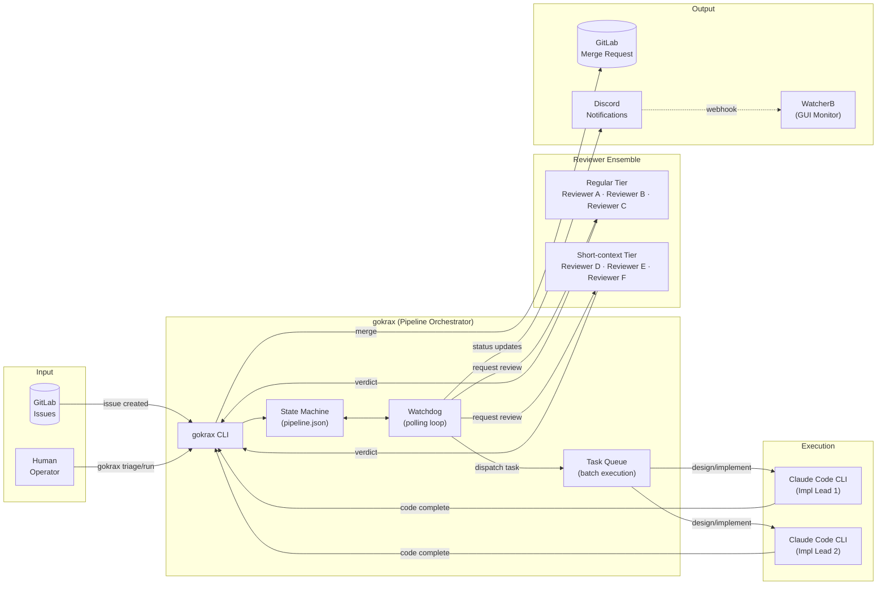
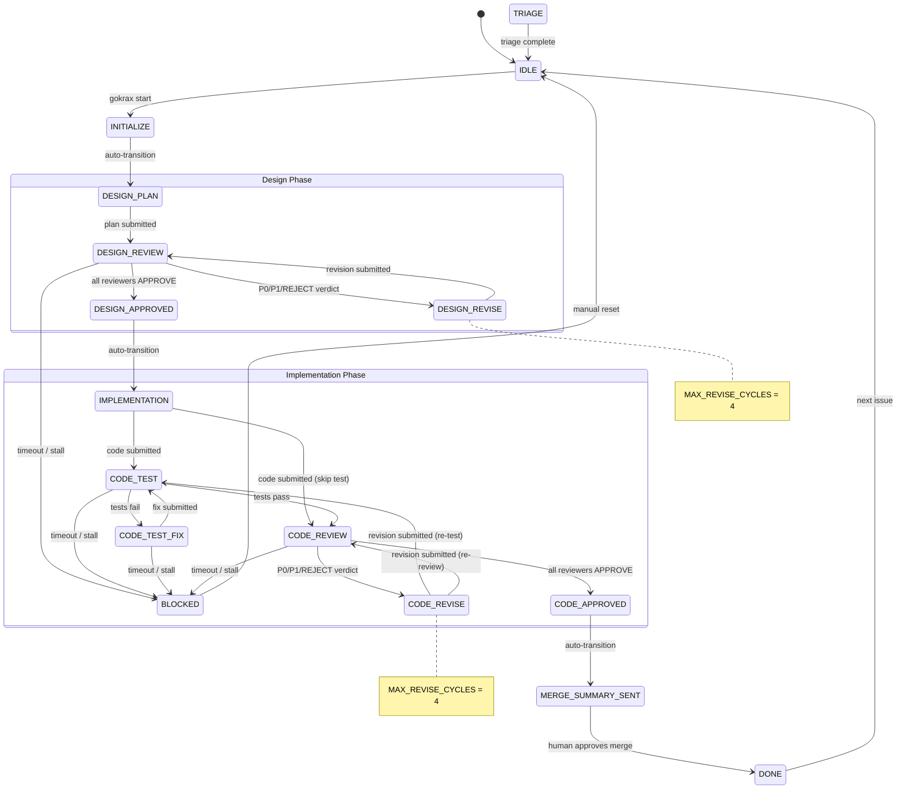
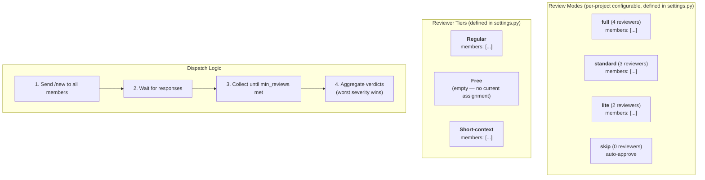
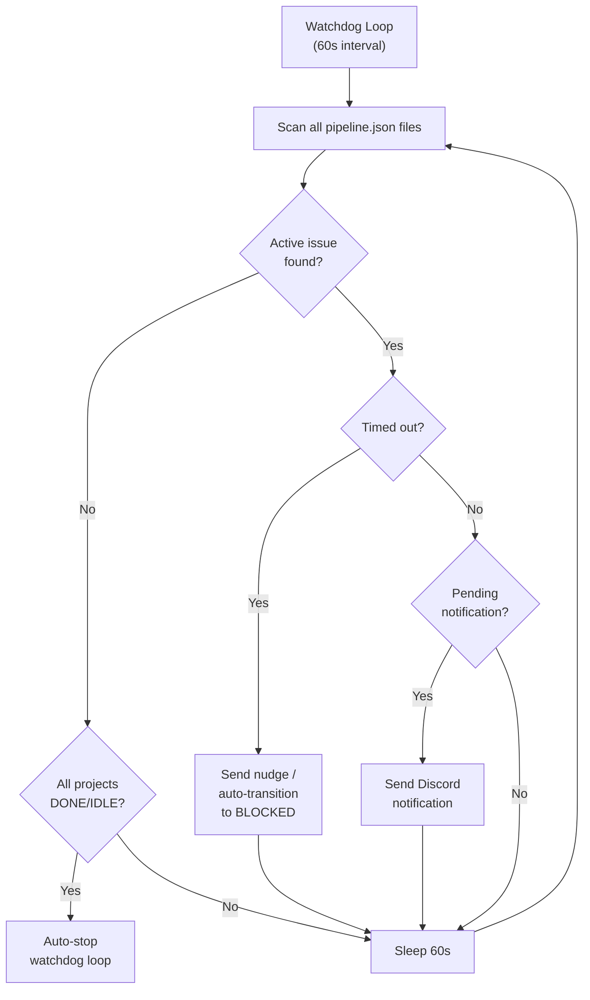
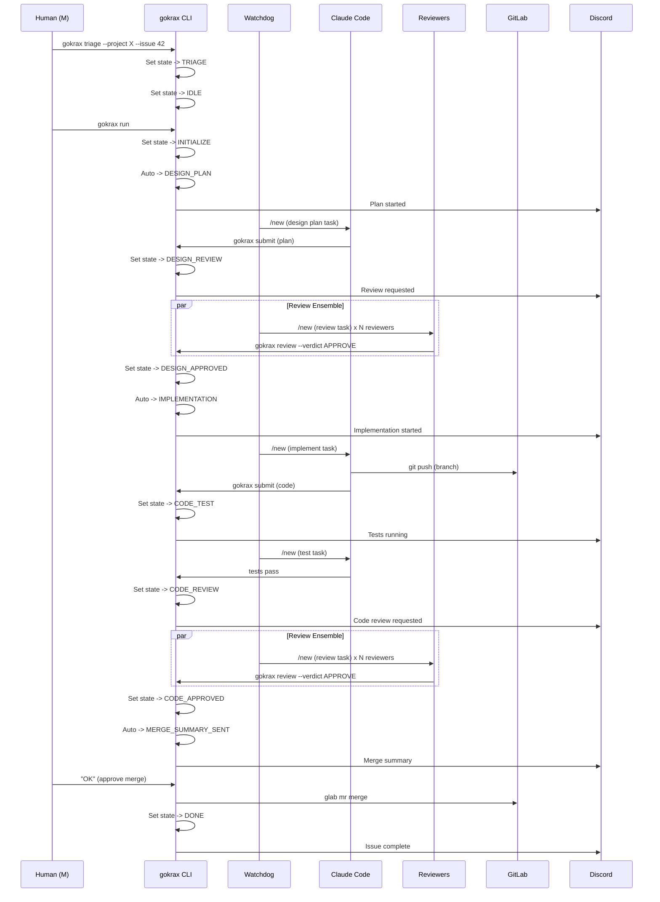

# gokrax — Architecture & State Machine Diagrams

> Last updated: 2026-03-20

## 1. System Architecture (Overall Flow)

## 2. Pipeline State Machine (Main Flow)

### VALID_TRANSITIONS (reference)

| From | To |
|------|----|
| TRIAGE | IDLE |
| IDLE | INITIALIZE |
| INITIALIZE | DESIGN_PLAN |
| DESIGN_PLAN | DESIGN_REVIEW |
| DESIGN_REVIEW | DESIGN_APPROVED, DESIGN_REVISE, BLOCKED |
| DESIGN_REVISE | DESIGN_REVIEW |
| DESIGN_APPROVED | IMPLEMENTATION |
| IMPLEMENTATION | CODE_TEST, CODE_REVIEW |
| CODE_TEST | CODE_REVIEW, CODE_TEST_FIX, BLOCKED |
| CODE_TEST_FIX | CODE_TEST, BLOCKED |
| CODE_REVIEW | CODE_APPROVED, CODE_REVISE, BLOCKED |
| CODE_REVISE | CODE_TEST, CODE_REVIEW |
| CODE_APPROVED | MERGE_SUMMARY_SENT |
| MERGE_SUMMARY_SENT | DONE |
| DONE | IDLE |
| BLOCKED | IDLE |

## 3. Review Ensemble Detail

### Review Modes Table

Review modes are defined in `settings.py` (`REVIEW_MODES`). See `settings.example.py` for defaults.

| Mode | Members | min_reviews | grace_period_sec |
|------|---------|-------------|------------------|
| full | `settings.py` の `REVIEW_MODES` で定義 | 4 | 0 |
| standard | `settings.py` の `REVIEW_MODES` で定義 | 3 | 0 |
| lite | `settings.py` の `REVIEW_MODES` で定義 | 2 | 0 |
| skip | (none) | 0 | 0 |

### Reviewer Tiers

Reviewer tiers are defined in `settings.py` (`REVIEWER_TIERS`). See `settings.example.py` for defaults.

| Tier | Members |
|------|---------|
| Regular | [] |
| Free | [] |
| Short-context | [] |

## 4. Watchdog Cycle

## 5. End-to-End Issue Lifecycle (Sequence)

