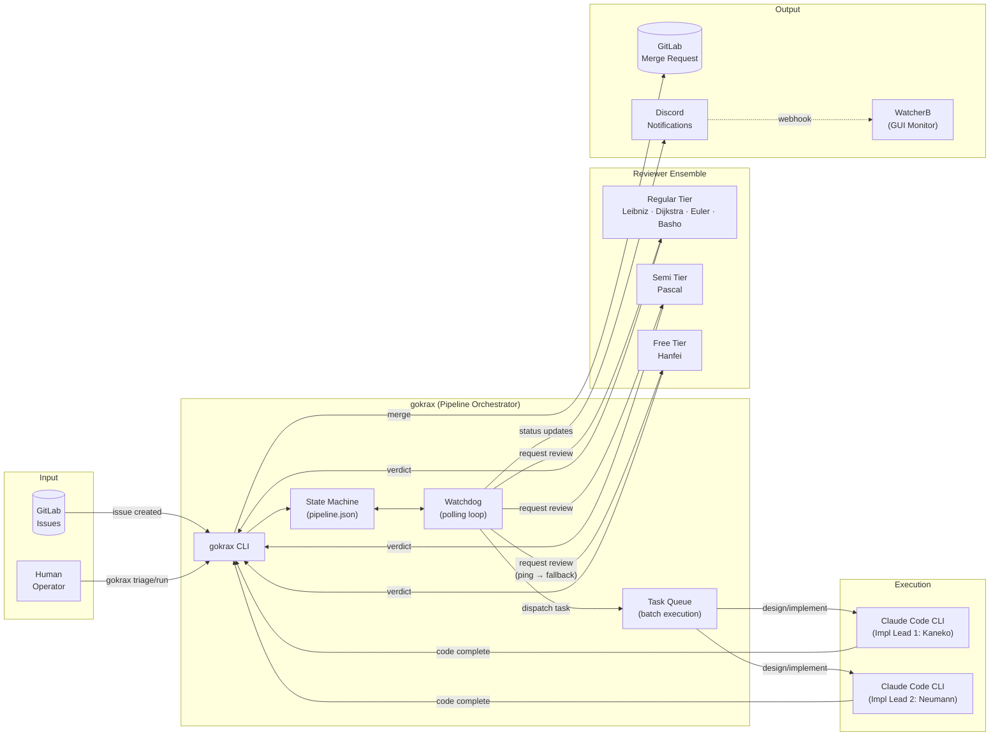
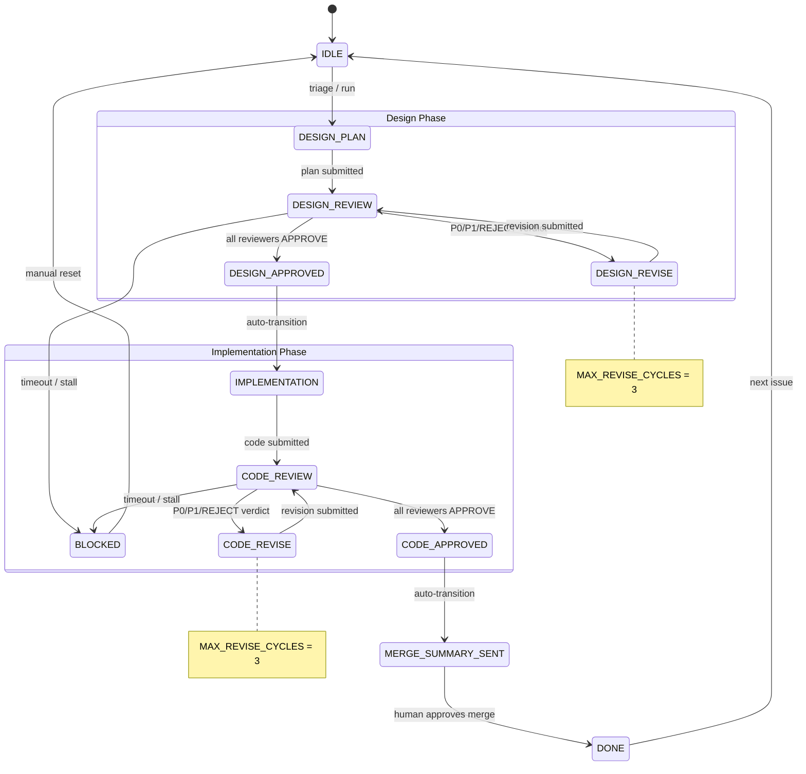
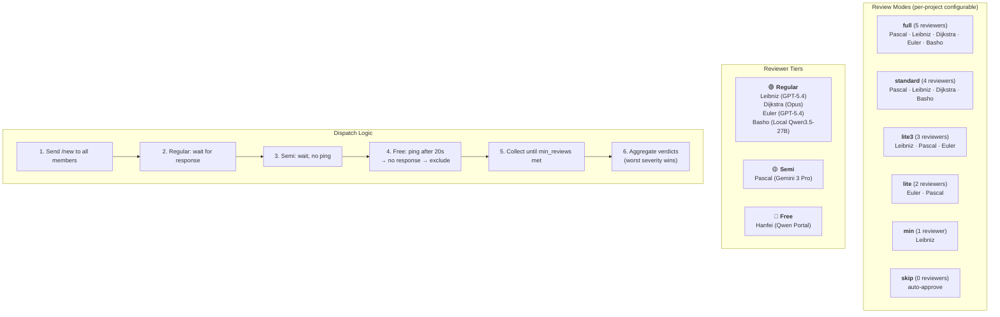
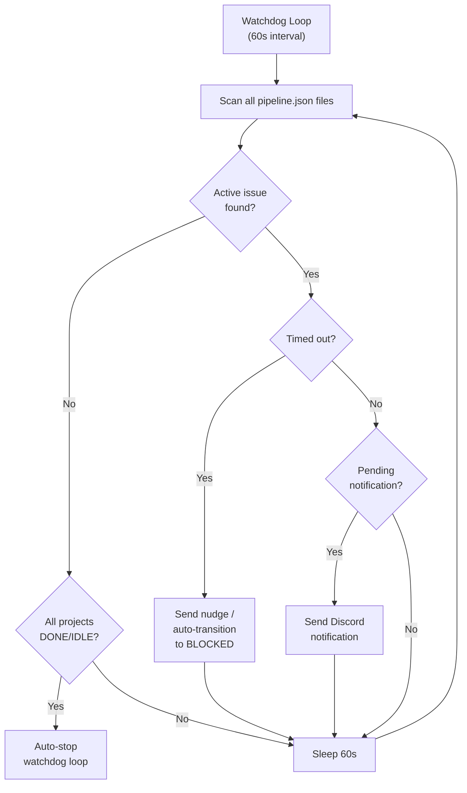
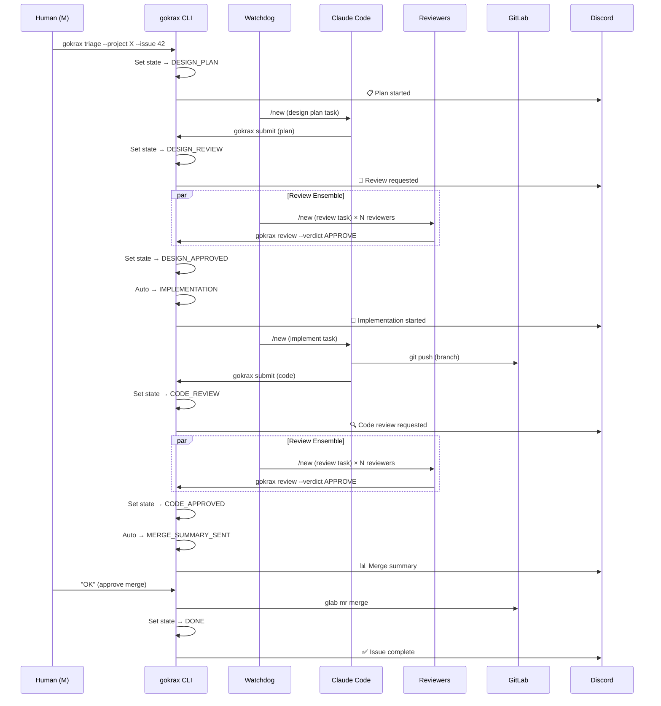

# gokrax — Architecture & State Machine Diagrams

## 1. System Architecture (Overall Flow)

## 2. Pipeline State Machine (Main Flow)

## 3. Review Ensemble Detail

## 4. Watchdog Cycle

## 5. End-to-End Issue Lifecycle (Sequence)

