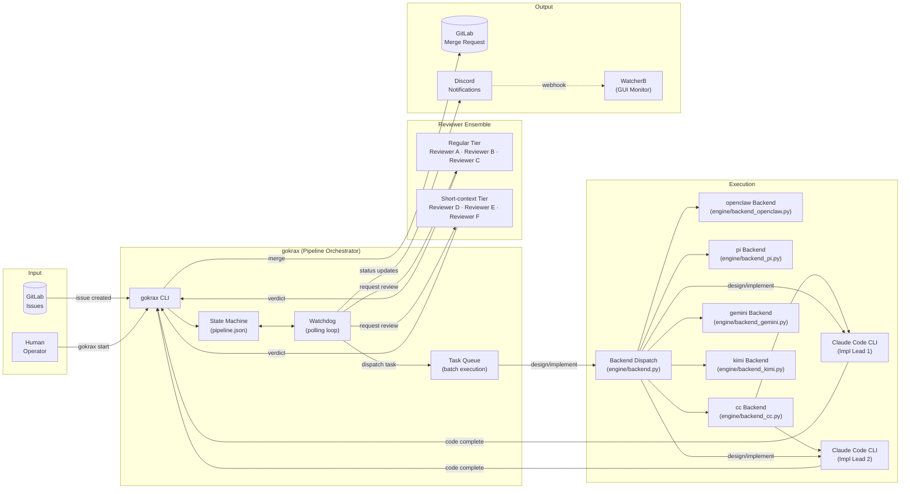
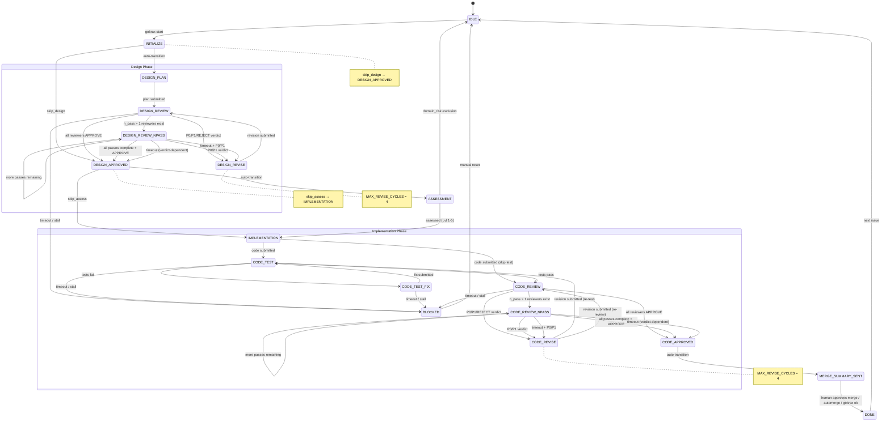
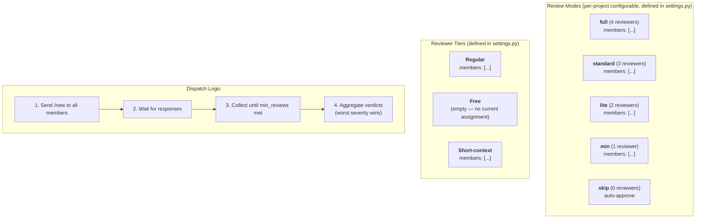
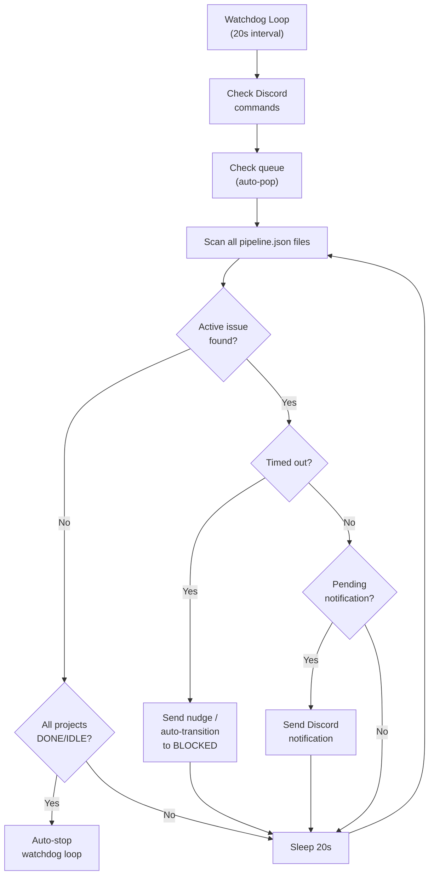
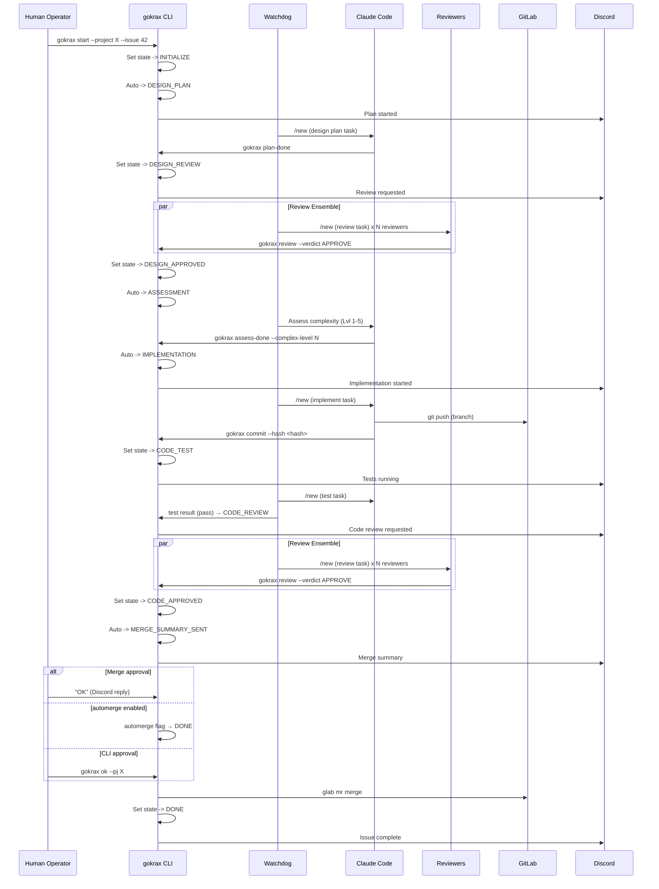
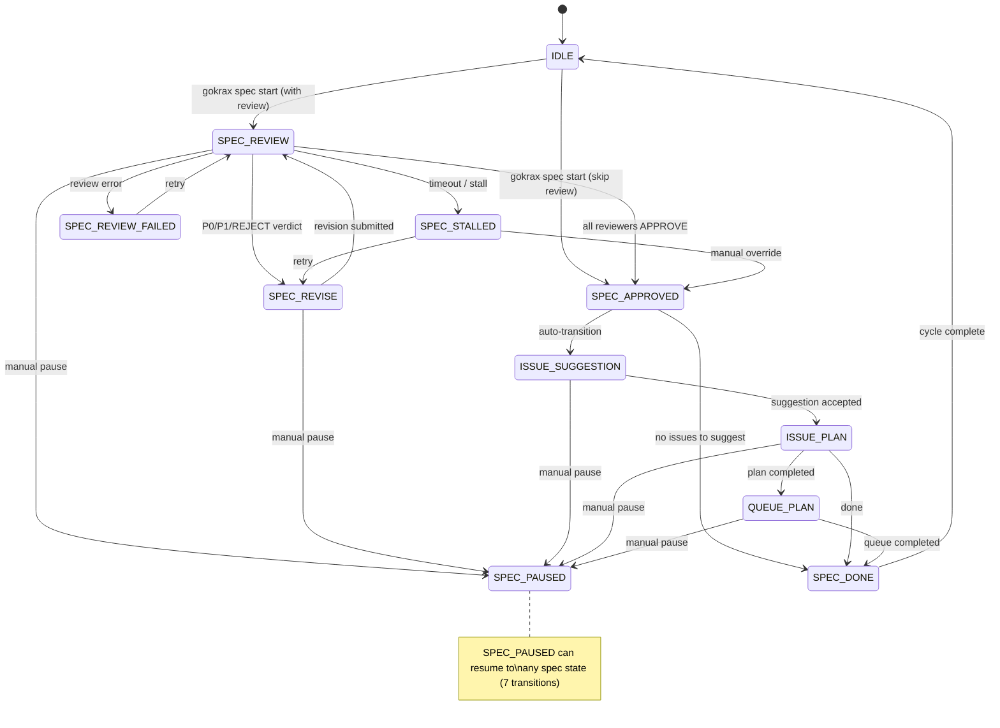

# gokrax — Architecture & State Machine Diagrams

> Last updated: 2026-03-29

## 1. System Architecture (Overall Flow)



## 2. Pipeline State Machine (Main Flow)



### VALID_TRANSITIONS (reference)

| From | To |
|------|----|
| IDLE | INITIALIZE |
| INITIALIZE | DESIGN_PLAN, DESIGN_APPROVED |
| DESIGN_PLAN | DESIGN_REVIEW |
| DESIGN_REVIEW | DESIGN_APPROVED, DESIGN_REVISE, BLOCKED, DESIGN_REVIEW_NPASS |
| DESIGN_REVIEW_NPASS | DESIGN_APPROVED, DESIGN_REVISE, DESIGN_REVIEW_NPASS |
| DESIGN_REVISE | DESIGN_REVIEW |
| DESIGN_APPROVED | ASSESSMENT, IMPLEMENTATION |
| ASSESSMENT | IMPLEMENTATION, IDLE |
| IMPLEMENTATION | CODE_TEST, CODE_REVIEW |
| CODE_TEST | CODE_REVIEW, CODE_TEST_FIX, BLOCKED |
| CODE_TEST_FIX | CODE_TEST, BLOCKED |
| CODE_REVIEW | CODE_APPROVED, CODE_REVISE, BLOCKED, CODE_REVIEW_NPASS |
| CODE_REVIEW_NPASS | CODE_APPROVED, CODE_REVISE, CODE_REVIEW_NPASS |
| CODE_REVISE | CODE_TEST, CODE_REVIEW |
| CODE_APPROVED | MERGE_SUMMARY_SENT |
| MERGE_SUMMARY_SENT | DONE |
| DONE | IDLE |
| BLOCKED | IDLE |

## 3. Review Ensemble Detail



### Review Modes Table

Review modes are defined in `settings.py` (`REVIEW_MODES`). See `settings.example.py` for defaults.

| Mode | Members | min_reviews | grace_period_sec | n_pass |
|------|---------|-------------|------------------|--------|
| full | Defined in `settings.py` `REVIEW_MODES` | 4 | 0 | — |
| standard | Defined in `settings.py` `REVIEW_MODES` | 3 | 0 | — |
| lite | Defined in `settings.py` `REVIEW_MODES` | 2 | 0 | — |
| min | Defined in `settings.py` `REVIEW_MODES` | 1 | 0 | — |
| skip | (none) | 0 | 0 | — |
| standard-x2 | Defined in `settings.py` `REVIEW_MODES` | 3 | 0 | {reviewer1: 2, reviewer3: 2} |

### Phase Override

Review modes support per-phase (design/code) configuration overrides.
Fields not overridden inherit from the mode's top-level defaults.

Example in `settings.py`:
```python
"full-custom": {
    "members": ["reviewer1", "reviewer2", "reviewer3", "reviewer4"],
    "code": {
        "members": ["reviewer1", "reviewer2", "reviewer3"],
        "n_pass": {"reviewer1": 2},
    },
}
```

### Reviewer Tiers

Reviewer tiers are defined in `settings.py` (`REVIEWER_TIERS`). See `settings.example.py` for defaults.

| Tier | Members |
|------|---------|
| Regular | [] |
| Free | [] |
| Short-context | [] |

### N-Pass Review

N-pass review allows specified reviewers to perform multiple review passes on the same code/design.

#### Configuration

Add `n_pass` to a review mode in `settings.py`:

```python
"standard-x2": {
    "members": [],
    "min_reviews": 3,
    "n_pass": {"reviewer1": 2, "reviewer3": 2},
}
```

Reviewers not listed in `n_pass` default to 1 pass.

#### Flow

1. Pass 1 completes normally in DESIGN_REVIEW / CODE_REVIEW
2. If any reviewer has `n_pass > 1`, transitions to *_REVIEW_NPASS
3. NPASS reviewers receive a lightweight prompt (no issue body/diff re-send)
4. When all NPASS passes complete, final verdict uses `count_reviews()` — counts each reviewer's latest verdict as one vote (n_pass=1 reviewers included)
5. P0/P1 from any submitted reviewer → immediate REVISE (no timeout wait needed)
6. After REVISE → REVIEW, pass counters reset; pass 1 starts over (does not re-enter NPASS directly)

#### GitLab Note Behavior in Intermediate Passes

- APPROVE in intermediate pass (pass < target_pass): GitLab note is **skipped**
- P0/P1/P2 in intermediate pass: GitLab note is **posted** (so developers can see the feedback)

#### Timeout

- NPASS uses the same timeout as the base REVIEW state
- On timeout: `count_reviews()` collects all current verdicts (incomplete NPASS reviewers retain their pass 1 verdict) and `_resolve_review_outcome` determines the transition. P0/P1 → REVISE even on timeout
- NPASS does **not** transition to BLOCKED

#### Forced Externalization

- Triggered at CODE_REVIEW state entry (inside `notify_reviewers`), not at queue submission
- When `n_pass > 1` reviewers exist in the review mode, CODE_REVIEW always externalizes review data to a file, regardless of message size
- This ensures NPASS prompts can reference the file path
- Existing queued batches are unaffected until they enter CODE_REVIEW

## 4. Watchdog Cycle



## 5. End-to-End Issue Lifecycle (Sequence)



## 6. Spec Mode State Machine

Spec mode manages the specification review cycle, separate from the main pipeline flow.
Entry point: `gokrax spec start` transitions from IDLE → SPEC_REVIEW (with review) or IDLE → SPEC_APPROVED (review skipped).

### Spec States

SPEC_REVIEW, SPEC_REVISE, SPEC_APPROVED, ISSUE_SUGGESTION, ISSUE_PLAN, QUEUE_PLAN, SPEC_DONE, SPEC_STALLED, SPEC_REVIEW_FAILED, SPEC_PAUSED

### SPEC_TRANSITIONS (reference)

| From | To |
|------|----|
| IDLE | SPEC_REVIEW, SPEC_APPROVED |
| SPEC_REVIEW | SPEC_REVISE, SPEC_APPROVED, SPEC_STALLED, SPEC_REVIEW_FAILED, SPEC_PAUSED |
| SPEC_REVISE | SPEC_REVIEW, SPEC_PAUSED |
| SPEC_APPROVED | ISSUE_SUGGESTION, SPEC_DONE |
| ISSUE_SUGGESTION | ISSUE_PLAN, SPEC_PAUSED |
| ISSUE_PLAN | QUEUE_PLAN, SPEC_DONE, SPEC_PAUSED |
| QUEUE_PLAN | SPEC_DONE, SPEC_PAUSED |
| SPEC_DONE | IDLE |
| SPEC_STALLED | SPEC_APPROVED, SPEC_REVISE |
| SPEC_REVIEW_FAILED | SPEC_REVIEW |
| SPEC_PAUSED | SPEC_REVIEW, SPEC_REVISE, SPEC_APPROVED, ISSUE_SUGGESTION, ISSUE_PLAN, QUEUE_PLAN, SPEC_DONE |



## 7. Task Queue (Batch Execution)

### Queue File Format

Queue file: `gokrax-queue.txt` — one entry per line:

```
PROJECT ISSUES [MODE] [OPTIONS...]
```

### CLI Commands

| Command | Description |
|---------|-------------|
| `gokrax qrun` | Pop next queue entry and start |
| `gokrax qstatus` | Show queue + running batch status |
| `gokrax qadd` | Append entry to queue |
| `gokrax qdel` | Remove entry from queue |
| `gokrax qedit` | Edit entry in queue |

### Queue Options

Available options: `automerge`, `skip_cc_plan`, `no-cc`, `keep_ctx_intra`, `skip_test`, `skip_assess`, `skip_design`, `impl=MODEL`, `plan=MODEL`.
See `settings.example.py` `DEFAULT_QUEUE_OPTIONS` for defaults.

### Discord Integration

Watchdog's `check_discord_commands()` processes queue commands (`qrun`, `qstatus`, `qadd`, `qdel`, `qedit`) from Discord.

### QueueSkipError Retry

When `gokrax qrun` encounters a skippable condition (e.g., all issues closed), it exits with code 75 (`EXIT_QUEUE_SKIP`).

- `_check_queue()`: `while True` loop until a non-skip result. Each skipped entry is marked `# done:` by `pop_next_queue_entry`, so the loop always terminates (queue exhaustion → exit 0).
- `_handle_qrun()`: Same `while True` drain loop with batched Discord notifications.

Exit codes:
| Code | Meaning |
|------|---------|
| 0 | Success or queue empty |
| 75 | Entry skipped (next entry available) |
| other | Error (no retry) |
