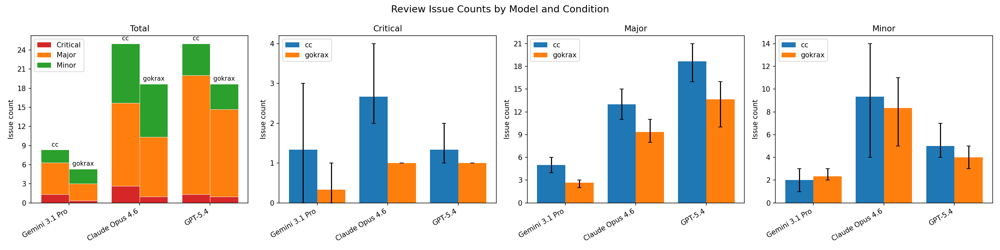

# Report: End-to-End Comparison of gokrax and Claude Code

Author: M. Ataka

Uploaded: 7th April 2026

## 1. Objective

This report evaluates the performance of ensemble review — the core mechanism of gokrax — through an end-to-end comparison. The gokrax pipeline (ensemble review) and Claude Code (no review) build the same application from scratch using the same specification and issues. The resulting codebases are compared by issue counts.

## 2. Methods

### 2.1 Target Application

A parts vendor discovery/procurement tool, "chortal" (including YAML DB, PySide6 GUI, CLI, Markdown export), planned for actual use by the author. 16 issues were created from a single specification (`docs/spec-rev10.md`) that went through 10 revision rounds with ensemble review before the experiments began.

### 2.2 Conditions

| | **gokrax pipeline** | **Claude Code** |
|---|---|---|
| Repository | [chortal-test-gokrax](https://gitlab.com/atakalive/chortal-test-gokrax) | [chortal-test-cc](https://gitlab.com/atakalive/chortal-test-cc) |
| Pipeline stages | DESIGN_PLAN → DESIGN_REVIEW → IMPL → CODE_REVIEW → MERGE | IMPL → MERGE |
| Design review | 3–4 reviewers | Skipped |
| Code review | 3–4 reviewers (same as design review) | Skipped |
| Implementer | Claude Code CLI, Opus 4.6 | Claude Code CLI, Opus 4.6 |
| Claude Code Mode | Implementation only | Plan → Implementation |

### 2.3 Shared Parameters

- **Specification**: spec-rev10.md (identical)
- **Issues**: 16 (S-1 through S-16), identical titles and bodies
- **Thinking level (reviewer)**: medium
- **Thinking level (implementer)**: medium (Claude Code CLI default for Opus 4.6; not explicitly specified)
- **Batching**: 9 batches with dependency ordering (identical structure)
- **Automated tests**: Skipped in both conditions (`skip-test`)
- **gokrax version** (commit hash): 03669689f1417a2fb606f994422667f091e9f6de
- **Experiment date**: 5th April 2026

### 2.4 gokrax Review Configuration

**Reviewer setup**

- **full**: 4 reviewers — Claude Opus 4.6, Gemini 2.5 Pro, GPT-5.4, Qwen3.5-27B-Q8_0 (local)
- **lite**: 3 reviewers — Claude Opus 4.6, Gemini 2.5 Pro, Qwen3.5-27B-Q8_0 (local)

GPT-5.4 was selected to be excluded from lite mode due to the author's limited OpenAI token budget.

**Queue options in gokrax**

`keep-ctx-intra` (session continuity within design→code), `skip-cc-plan`, `skip-test`, `p2-fix`  
[Note: `automerge` option was enabled by default.]

**Agent details**

See `log-test-gokrax/agents_used.md` in ``chortal-test-gokrax`` repository.

### 2.5 Batch Structure

Issue separation, batch structure, and review mode were decided by LLM agents in gokrax spec mode.

| Batch | Issues | Description | Review mode |
|-------|--------|-------------|-------------|
| 1 | 1, 3 | Foundation (skeleton + config + schema ‖ lock + atomic write) | lite |
| 2 | 2 | Vendor data model | lite |
| 3 | 4, 5, 6 | Read operations (search ‖ export ‖ prompt gen) | lite |
| 4 | 7, 9 | Inbox/Patch core logic | full |
| 5 | 8, 10, 11 | CLI commands | lite |
| 6 | 12 | GUI main window skeleton | lite |
| 7 | 13, 14 | GUI filter + dialogs | full |
| 8 | 15 | GUI workflow integration | full |
| 9 | 16 | GUI external change detection + integration tests + packaging | lite |

### 2.6 Time Measurement

Completion time was measured from the queue start to the last batch reaching DONE, based on timestamps in the gokrax log files.

### 2.7 Evaluation

Both codebases are evaluated by LLMs acting as independent code reviewers **without persona or review-perspective injection** (raw model behavior). Each model receives the same prompt and reviews the entire codebase of both conditions. The primary metric is the number of issues found per codebase per model.

**Evaluation models**

Three LLMs were used for evaluation of the codebases.

- Gemini 3.1 Pro (Run on Antigravity, think: high, id: `ag-gemini31pro`)
- Claude Opus 4.6 (Run on VSCode, think: medium (default), id: `cc-opus46`)
- GPT 5.4 (Run on pi-coding-agent, think: medium, id: `pi-gpt54`)

**Severity classification**

Each detected issue was classified as Critical, Major, or Minor.

- **Critical**: Incorrect behavior, data loss risk, security vulnerability
- **Major**: Spec non-compliance, significant design flaw, missing error handling
- **Minor**: Style inconsistency, naming issues, missing docstrings, minor redundancy

**Prompt**

The identical prompt was used for all models and both codebases.

> You are reviewing a Python codebase for a vendor discovery and procurement tool (Chortal). The application includes a YAML-based vendor database, PySide6 GUI, CLI interface, and Markdown export.
>
> Review scope: `chortal/`, `tests/`, and `schema/` directories only.
>
> The specification is `docs/spec-rev10.md`. Reference it when reporting spec violations.
>
> Review the entire codebase and list all issues you find. For each issue:
> 1. **Severity**: Critical / Major / Minor
> 2. **File**: file path (relative to project root)
> 3. **Line** (optional): line number or range if applicable
> 4. **Description**: what the issue is and why it matters
>
> Focus on:
> - Correctness (bugs, logic errors)
> - Robustness (error handling, edge cases, race conditions)
> - Spec compliance (deviations from docs/spec-rev10.md)
> - Design quality (abstraction, coupling, maintainability)
>
> Do not suggest new features. Only report problems with the existing code.
>
> **Output format**: Write results as a JSON array to `audit/eval_{model_name}_{trial#}_{datetime}.json` (relative to project root). Each element must have the following fields:
>
> ```json
> {
>   "severity": "Critical" | "Major" | "Minor",
>   "file": "chortal/models.py",
>   "line": "42-45",
>   "description": "..."
> }
> ```
>
> The `line` field may be `null` if not applicable. After writing the JSON file, print a one-line summary: `Total: N issues (C critical, M major, m minor)`.

**Trials**

Because LLMs respond stochastically, three trials per model per codebase were executed independently. Each run was started from a fresh session with neither prior context nor conversation history. To avoid the agents accidentally seeing other reports, each report was manually moved away before starting the next trial.

**Procedure**

1. For each evaluation model, run the review prompt 3 times against chortal-test-cc (independent sessions)
2. For the same model, run the identical prompt 3 times against chortal-test-gokrax
3. Collect issue counts by severity per trial
4. Report mean and range (min–max) of total and per-severity issue counts
5. Compare across conditions

## 3. Results

### 3.1 Completion Time

The elapsed time taken to complete all the batches was calculated from the log files. The gokrax pipeline took 2.56 times longer than the Claude Code baseline. 

| Condition | Completion time |
|---|---|
| Claude Code | 2 h 28 min |
| gokrax pipeline | 6 h 19 min (2.56x) |

### 3.2 Codebase Evaluation

To compare bugs and issues in the generated code, the codebase of each condition was evaluated by LLMs. The results show that the gokrax pipeline had fewer issues than the Claude Code condition in Critical and Major categories (Figure 1). In Minor issue counts, both conditions were comparable. The mean total issue count was lower in the gokrax pipeline. These results suggest that the quality of code generated through the gokrax pipeline with ensemble review is higher than that of Claude Code alone.

<a href="figs/260405_fig1_issues.png"></a>

**Figure 1. Issue counts detected by LLMs.**  
Left panel represents severity composition. Other panels show detected issue counts for each severity. Bars represent the mean of independent trials (_n_ = 3). Error bars indicate the min–max range. cc: Claude Code. gokrax: gokrax pipeline.

### 3.3 Test Results

To evaluate code quality from another perspective, `pytest` was executed on both codebases. Although Claude Code produced more tests, some of them failed. All 8 failures in the Claude Code condition were in CLI and GUI-related integration tests, introduced in S-16 (7 failures, final batch) and S-15 (1 failure).

| Condition | Test Failed | Test Passed |
|---|---|---|
| Claude Code | 8 | 428 |
| gokrax pipeline | 0 | 313 |


## 4. Discussion

The results show a trade-off between speed (Section 3.1) and code quality (Section 3.2). The gokrax pipeline required 2.56 times longer to complete than Claude Code alone, but produced code with fewer Critical and Major issues (Figure 1). This suggests that the additional time spent on ensemble review rounds translates into improved code quality.

The reduction in Critical and Major issues is particularly notable because these categories represent bugs that may cause runtime crash and require fixes after deployment. Minor issue counts were comparable between conditions, suggesting that the difference in code quality is concentrated in higher-severity categories.

There are several reasons why the gokrax pipeline takes longer (Section 3.1). The primary reason is that multiple review rounds are synchronously driven by higher-latency LLMs compared with Claude Code. In this experiment, the rate-limiting factors were the local LLM and Google Gemini CLI (OAuth), both of which exhibited substantially longer response times. Overall, the slowdown of the gokrax pipeline is the cost of stability in the simplified pipeline and is an unavoidable architectural trade-off, at least at this early stage.

The test results (Section 3.3) suggest that without code review or test feedback, issues introduced in later batches can go undetected and accumulate across successive implementation steps.

These results were obtained from building a single application from scratch with 16 issues. The generalizability to other scenarios — such as adding features to existing codebases, refactoring, or larger-scale projects — remains to be investigated. Additionally, the codebase evaluation relies entirely on LLM-based review, which may introduce systematic biases in issue detection. Human evaluation of the generated codebases is planned as a follow-up to validate these findings.
